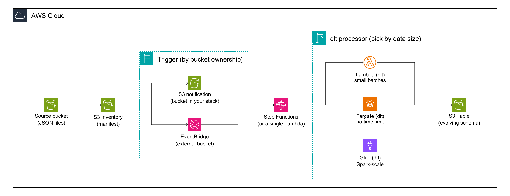

# Event-Driven Data Pipelines on AWS

Turn a bucket of drifting JSON into a queryable, evolving-schema **Amazon S3 Table**,
with no cron job. Files land in a source bucket, a daily **S3 Inventory** manifest
triggers a **Lambda**, and **dlt** normalizes the listed JSON into an S3 Table.



## How it works

1. JSON files land under `data/` in the source bucket.
2. **S3 Inventory** produces a daily `manifest.json` under `inventory/`.
3. The manifest landing fires an **S3 notification** to the Lambda (the bucket is in
   this stack, so no EventBridge needed; use EventBridge only for buckets you do not
   own).
4. The Lambda reads the manifest, follows it to the inventory data files, reads each
   source JSON, and **dlt** normalizes the batch: nested objects become columns,
   lists become child tables, and the schema evolves automatically when new fields
   appear.
5. The flat result is appended to a managed **S3 Table** (Apache Iceberg), queryable
   from Athena.

No duckdb, no container. dlt writes Parquet to `/tmp`, pyarrow reads it, and
pyiceberg writes to the S3 Table through its Iceberg REST catalog using pyarrow's
S3 FileIO, so the whole function fits in a ~216 MB zip.

## Prerequisites

- AWS credentials configured, in a region where **S3 Tables** is available (e.g.
  `us-east-1`).
- [AWS SAM CLI](https://docs.aws.amazon.com/serverless-application-model/latest/developerguide/install-sam-cli.html)
- [uv](https://docs.astral.sh/uv/) (SAM's `python-uv` build method uses it)
- Docker is **not** required (this is a zip function, not a container).

## Deploy

The `python-uv` build method is a SAM beta feature, so pass `--beta-features`
(already enabled in `samconfig.toml`).

```bash
sam build --beta-features
sam deploy --beta-features
```

That creates the source bucket (with the inventory configuration and the manifest
trigger), the S3 Table bucket, and the Lambda.

## Try it

Upload some JSON, then let the pipeline run:

```bash
SRC=$(aws cloudformation describe-stacks --stack-name event-driven-pipelines \
  --query "Stacks[0].Outputs[?OutputKey=='SourceBucketName'].OutputValue" --output text)

aws s3 cp data/ "s3://$SRC/data/" --recursive
```

**S3 Inventory runs on a daily schedule, and the first manifest can take up to 24 to
48 hours to appear.** To see the pipeline run immediately, drop a manifest by hand in
the inventory layout (see `docs/article.md`); the scheduled inventory then fires the
same path on its own.

Check the result in the S3 Table (via Athena, or pyiceberg):

```python
from pyiceberg.catalog.rest import RestCatalog

cat = RestCatalog("s3tables", **{
    "uri": "https://s3tables.us-east-1.amazonaws.com/iceberg",
    "warehouse": "<TableBucketArn from stack outputs>",
    "rest.sigv4-enabled": "true",
    "rest.signing-name": "s3tables",
    "rest.signing-region": "us-east-1",
})
print(cat.load_table(("raw", "applications")).scan().to_arrow().to_pandas())
```

## Verified

Deployed and run on a real account: a manifest listing **120 JSON files** whose fields
drift from three to six landed **120 rows** in the S3 Table in about six seconds, with
the schema carrying every field the JSON had grown.

## Layout

| Path | What it is |
|---|---|
| `template.yaml` | SAM stack: source bucket + inventory + notification, S3 Table, Lambda. |
| `lambda/handler.py` | Reads the manifest, normalizes the JSON with dlt, writes to the S3 Table. |
| `lambda/requirements.txt` | `dlt`, `pyiceberg`, `pyarrow` (boto3 comes from the runtime). |
| `data/` | Sample JSON showing the schema drift. |
| `docs/` | The diagram and the article. |

## Tear it down

```bash
sam delete --stack-name event-driven-pipelines
```

The S3 Table bucket may need its tables emptied first if you have run the pipeline.
